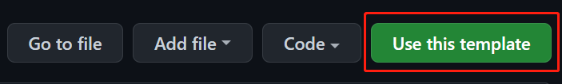

# userscript-typescript-template

Template repo using Webpack and TypeScript to build your userscript for Tampermonkey and more extensions.

Automatically generate headers from your package.json!

## Useage (two-ways)

### 1. Generate repostiory from template or clone it

#### - Use this template to create your new repository



#### - Clone this repository

```bash
# Use Github CLI
$ gh repo clone pboymt/userscript-typescript-template
# Or use 'git clone' command directly
$ git clone https://github.com/pboymt/userscript-typescript-template.git
```

### Development

1. Allow Tampermonkey's access to local file URIs. ([Tampermonkey FAQs](https://tampermonkey.net/faq.php?ext=dhdg#Q204))
2. Install dependencies with `npm install` or `npm ci`.
3. Write `userscript` settings in package.json, you can refer to the comments in [plugins/userscript.plugin.ts](./plugins/userscript.plugin.ts).
4. Code your userscript in `src` directory (like [src/index.ts](./src/index.ts)).
5. Generate userscript with `npm run build`.
6. Import generated userscript to Tampermonkey by local file URI.

### Use other file types

You need install other loader plugins to support other file types.

For example, you can use `scss-loader` to compile `.scss` files. Install it with `npm install --save-dev scss-loader node-sass` and add it in [webpack.config.ts](./webpack.config.ts).

### After

You can publish your userscript to [Greasy Fork](https://greasyfork.org/) or other websites.

You can push your userscript to [Github](https://github.com) and import it to [Greasy Fork](https://greasyfork.org/import).